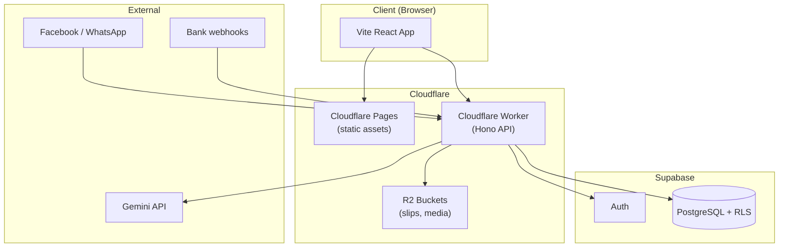

# ArmAI

**AI-powered e-commerce platform for Laos sellers** — multi-tenant SaaS with Facebook/WhatsApp chatbot, slip verification, bank webhook, and auto-matching of transfers to orders.

Merchants get a dashboard to manage products, orders, payment accounts, and AI prompts. Super admin and support modes for platform operators. Built for the Laos market with multi-currency (LAK/THB) and local workflows.

> **New to the repo?** Start with [Folder structure](#folder-structure) and [How to run locally](#how-to-run-locally). For deployment and env details, see [Deployment](#deployment) and the `docs/` folder.

---

## Tech stack

| Layer               | Technology                                              |
| ------------------- | ------------------------------------------------------- |
| **Frontend**        | Vite + React (TypeScript), deployed on Cloudflare Pages |
| **API**             | Cloudflare Workers, Hono, TypeScript                    |
| **Database & Auth** | Supabase (PostgreSQL, Auth, RLS)                        |
| **AI**              | Google Gemini 1.5 Flash (chat, slip extraction)         |
| **Storage**         | Cloudflare R2 (slip images, channel media)              |
| **Monorepo**        | npm/pnpm workspaces (`apps/*`, `packages/*`)            |

---

## Architecture (high-level)



- **Browser** loads the React app from Pages and talks to the Worker API.
- **Worker** handles auth (via Supabase), business logic, AI (Gemini), and storage (R2).
- **Supabase** is the source of truth for users, merchants, orders, and config.
- **Facebook/WhatsApp** and **bank webhooks** send events to the Worker.

---

## Folder structure

```
armai/
├── apps/
│   ├── web/          # Vite + React dashboard (merchant & super admin)
│   └── api/          # Cloudflare Worker (Hono) — auth, webhooks, merchant/super API
├── packages/
│   └── shared/       # Shared types, Zod schemas, matching logic, parsers
├── sql/              # Supabase SQL migrations (001_… to 080_…)
│                     # Run in order in Supabase SQL Editor
├── docs/             # Architecture, data model, auth, deployment, testing
├── eslint.config.js
├── .prettierrc
├── vitest.workspace.ts
└── package.json      # Root scripts: build, test, lint, format
```

- **apps/web**: Dashboard UI (React, React Router).
- **apps/api**: Single Worker; routes for health, auth, super, merchant, orders, webhooks (Facebook, WhatsApp, Telegram, bank).
- **packages/shared**: Used by both `api` and `web`; build with `npm run build -w packages/shared` (or via root `npm run build`).
- **sql/**: Run migrations in numeric order in your Supabase project (including `081_subscription_payments.sql` for subscriptions).

---

## Enterprise SaaS & Subscriptions (Laos)

The app is set up for **Laos-focused enterprise SaaS** ($50–300 USD/month):

- **UI/UX:** Neutral palette (primary #0070f3, accent #4caf50), responsive sidebar + top navbar, dark mode, Lao as default language (with English/Thai toggle), Phetsarath OT + Noto Sans Lao fonts.
- **Plans:** Basic ($50/month, core AI, limited users) and Pro ($300/month, advanced AI, unlimited users, analytics, priority support). Public `/api/plans` returns plans with USD and Kip equivalent.
- **Workflow:** Sign in → Pricing (`/pricing`) → Choose plan → Checkout (BCEL OnePay for Laos or Stripe) → Success/error pages. Subscription status and next billing are shown in Settings and dashboard.
- **Payment:** BCEL OnePay (primary for Laos: QR, Visa/MasterCard, UnionPay, Alipay/WeChat) and Stripe as fallback. Webhooks: `POST /api/webhooks/payment/stripe`, `POST /api/webhooks/payment/bcel`.
- **Localization:** All menus, buttons, and labels use `next-intl`-style keys; locale files in `apps/web/src/i18n/locales.ts` (lo, th, en). Default locale: Lao.

---

## How to run locally

**Requirements:** Node.js ≥18, pnpm (or npm).

### 1. Install dependencies

```bash
pnpm install
# or
npm install
```

### 2. Environment variables

**API (Cloudflare Worker)** — use Wrangler secrets or a `.dev.vars` file in `apps/api/` (see [Wrangler docs](https://developers.cloudflare.com/workers/wrangler/configuration/#local-development)). Example:

```env
# apps/api/.dev.vars (do not commit)
SUPABASE_URL=https://xxxx.supabase.co
SUPABASE_ANON_KEY=eyJ...
SUPABASE_SERVICE_ROLE_KEY=eyJ...
GEMINI_API_KEY=...
FACEBOOK_APP_SECRET=...
FACEBOOK_VERIFY_TOKEN=optional_webhook_token
# Optional: WHATSAPP_VERIFY_TOKEN, WHATSAPP_ACCESS_TOKEN, WHATSAPP_APP_SECRET
ENVIRONMENT=development
```

R2 buckets (`SLIP_BUCKET`, optional `CHANNEL_MEDIA_BUCKET`) are bound in `apps/api/wrangler.toml`; for local dev you can use miniflare’s built-in buckets. For subscriptions, set `STRIPE_SECRET_KEY`/`STRIPE_WEBHOOK_SECRET` or `BCEL_ONEPAY_*` and run `sql/081_subscription_payments.sql`.

**Web (Vite)** — create `apps/web/.env.local`:

```env
VITE_SUPABASE_URL=https://xxxx.supabase.co
VITE_SUPABASE_ANON_KEY=eyJ...
VITE_API_URL=http://localhost:8787/api
```

Replace with your Supabase project URL/keys and the local Worker URL (default Wrangler port 8787).

### 3. Database (Supabase)

1. Create a Supabase project.
2. Run the SQL migrations in **numeric order** in the Supabase SQL Editor:  
   `sql/001_extensions.sql` → `002_enums.sql` → … → `080_dashboard_rpc_optimizations.sql`  
   (Or run up to the set documented in your setup checklist.)
3. Create a user in Supabase Auth (e.g. sign up via the app or Auth dashboard).
4. Set that user as super admin, e.g. in SQL:  
   `UPDATE profiles SET role = 'super_admin' WHERE id = 'user-uuid';`

### 4. Start dev servers

```bash
# Terminal 1 — API (Worker)
pnpm dev -w apps/api
# or: npm run dev -w apps/api

# Terminal 2 — Web (Vite)
pnpm dev -w apps/web
# or: npm run dev -w apps/web
```

- API: usually `http://localhost:8787`
- Web: usually `http://localhost:5173`  
  Open the web app, sign in, and use Super or Merchant flows.

### 5. Build (optional)

```bash
pnpm build
# Builds shared → api → web
```

---

## Testing

Tests use **Vitest** (unit + component tests). No Cloudflare or Supabase needed for the test run.

```bash
pnpm test          # Watch mode
pnpm test:run      # Single run (CI-friendly)
pnpm test:ui       # Vitest UI
pnpm test:coverage # Coverage report
```

- **packages/shared**: Pure logic (matching, parsers, currency, schemas).
- **apps/api**: Services (e.g. response-mode-resolver, matching) with mocked Supabase where needed.
- **apps/web**: React components (e.g. StatCard, Badge, OrderSummaryCard) with React Testing Library.

See `docs/testing.md` and `vitest.workspace.ts` for project layout.

---

## Deployment

| Part          | Where              | Notes                                                                                                                                                                      |
| ------------- | ------------------ | -------------------------------------------------------------------------------------------------------------------------------------------------------------------------- |
| **API**       | Cloudflare Workers | Connect repo to Cloudflare; set secrets (SUPABASE*\*, GEMINI_API_KEY, FACEBOOK*\*, etc.) in Dashboard.                                                                     |
| **Web**       | Cloudflare Pages   | Build command: `npm run build -w apps/web` (or from root after building shared). Set env: `VITE_SUPABASE_URL`, `VITE_SUPABASE_ANON_KEY`, `VITE_API_URL` (your Worker URL). |
| **DB / Auth** | Supabase           | Run all `sql/` migrations; configure Auth providers if needed.                                                                                                             |

Deploy from GitHub (or your CI) to Cloudflare; avoid relying on local Wrangler for production. Full checklist: `docs/manual-setup-checklist.md` (if present) or `docs/deployment.md` and `docs/ARMAI-DOCS.md`.

---

## Git hooks (Husky + lint-staged)

On **commit**, a pre-commit hook runs:

- **lint-staged** runs only on **staged** files.
- For `*.ts`, `*.tsx`, `*.js`, `*.jsx`: **ESLint --fix** and **Prettier --write**.
- For `*.css`, `*.md`, `*.json`: **Prettier --write**.

If ESLint or Prettier fails, the commit is blocked. Fix the issues, stage again, and commit.  
To skip the hook (not recommended): `git commit --no-verify`.

---

## Scripts (root)

| Script              | Description                                                   |
| ------------------- | ------------------------------------------------------------- |
| `pnpm build`        | Build shared → api → web                                      |
| `pnpm dev`          | (Run per app: `pnpm dev -w apps/api`, `pnpm dev -w apps/web`) |
| `pnpm test`         | Vitest (watch)                                                |
| `pnpm test:run`     | Vitest single run                                             |
| `pnpm lint`         | ESLint (with cache)                                           |
| `pnpm lint:fix`     | ESLint with auto-fix                                          |
| `pnpm format`       | Prettier write all                                            |
| `pnpm format:check` | Prettier check only                                           |
| `pnpm typecheck`    | TypeScript check in all workspaces                            |

---

## Docs

- [Architecture](docs/architecture.md)
- [Data model](docs/data-model.md)
- [Auth flow](docs/auth-flow.md)
- [Deployment](docs/deployment.md)
- [Manual setup checklist](docs/manual-setup-checklist.md) (if present)
- [Testing](docs/testing.md)
- [Commerce extension](docs/extension-commerce.md) — catalog, knowledge base, payment accounts, orders, slip/matching.

---

## Security

- **RLS** on all tenant tables; no service role key in the browser.
- Admin and support actions only via the Worker with auth/role middleware; support mode is read-only and audited.

---

## License & support

Private repository. For setup and ops, see the `docs/` folder and your team’s runbooks.
